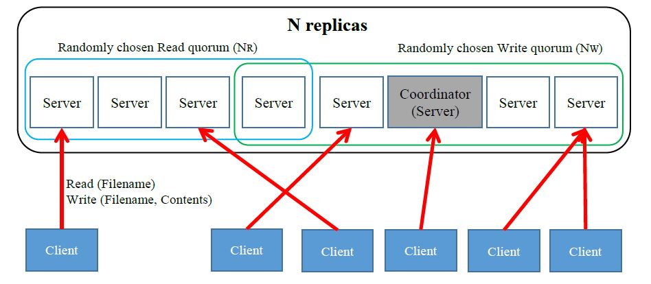

# SimpleDFS
#### Simple Distributed FIle System basen on the Gifford Quorum Consensus Protocol

## ABOUT

Using Thrift RPC and Java, this is a simple implementation of a Distributed File System using [Gifford Quorum Consensus](https://en.wikipedia.org/wiki/Quorum_(distributed_computing))
as a way to achieve replica consensus.
The system supports multiple clients and, one of the nodes serves as a centralized Coordinator which builds Read or Write Quorums for each operation. This implementation does concurrent reads for all requests and concurrent writes for different files and sequential write for the same file.

The Client is able to issue commands to read, write or list file from the terminal and additionally,
use a "simulate read/write" feature wherein it fires said type of requests with random delays and payloads. This is useful for load testing our system.

## CONFIGURATION and RUNNING THE CODE

*YOU NEED JAVA 1.8+ AND THRIFT 0.9+ TO RUN THIS SYSTEM*

* To run the code, we need to follow the following steps: \
(Everything needs to be run from the directory in which the files are present)
Setting up the config file like [Config File](gen-java/config.txt)
* First line of config.txt: Takes only 2 parameters (separated by a single whitespace). The first parameter is Nr and the second parameter is Nw.
* Second line of config.txt: Takes only 1 parameters which is the sync time (in ms)
  Eg: \ 
  4 4 \
  10000 \
* Setting up the test files in TestFiles folder: \

  localhost 9005 \
  localhost 9006 \
  localhost 9007 \
  localhost 9008 \
  r file37.txt \
  r file2.txt \
  r file7.txt \
  r file31.txt \
  r file37.txt \
  r file50.txt \
  r file1.txt \
  r file50.txt \
  r file31.txt \
  
  The first few lines provide the ip and port of all the connected servers (including the coordinator   node). The next few lines indicate the requests r/w for read/write followed by the filename. Please   Note: The connected servers in the system should be same as the servers mentioned in this file.       There ip-port should be same as well. Else, there is an error message shown gracefully. \

* Compile the project using: \
  javac -cp ".:/usr/local/Thrift/*" *.java -d .
* Then run the Coordinator using: \
  java -cp ".:/usr/local/Thrift/*" Server localhost 9005 null null \
* (Note: We pass four parameters, server ip, server port, coordinator ip and coordinator port. In case of coordinator node, we would have two nulls instead of coordinator ip and coordinator port. “Null” is indicative of coordinator property to the code. The following code also works with CSE machine labs and the ip and port can be changed) \
* Then run each of the Servers using: \
java -cp ".:/usr/local/Thrift/*" Server localhost 9002 localhost 9005 \
java -cp ".:/usr/local/Thrift/*" Server localhost 9003 localhost 9005 \
java -cp ".:/usr/local/Thrift/*" Server localhost 9004 localhost 9005 \
java -cp ".:/usr/local/Thrift/*" Server localhost 9006 localhost 9005 \
java -cp ".:/usr/local/Thrift/*" Server localhost 9007 localhost 9005 \
java -cp ".:/usr/local/Thrift/*" Server localhost 9008 localhost 9005 \
….
\
(Note: We pass four parameters, ip of the connecting server, port of the connecting server, coordinator ip, and coordinator port)
* Next, run the Client using: \
java -cp ".:/usr/local/Thrift/*" Client testFile50_50.txt \
java -cp ".:/usr/local/Thrift/*" Client testFile20_80.txt \
java -cp ".:/usr/local/Thrift/*" Client testFile40_60.txt \
….\
….\
….\
\
(Note: We pass only one parameter, which is the file that contains the test details of the read/write operations. 50_50 indicates that the number of reads are 50% and number of writes are 50%. Similarly for 20_80 the number of reads are 20% and number of writes are 80%. Each of the provided files in TestFiles Directory has 2000 operations that would be fired from the Client)
